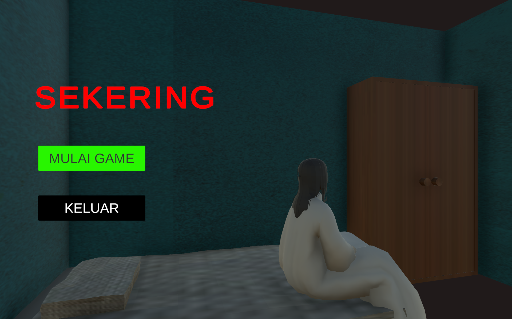
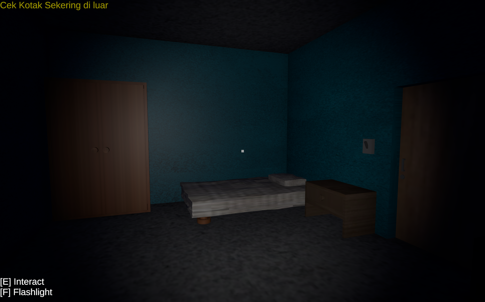
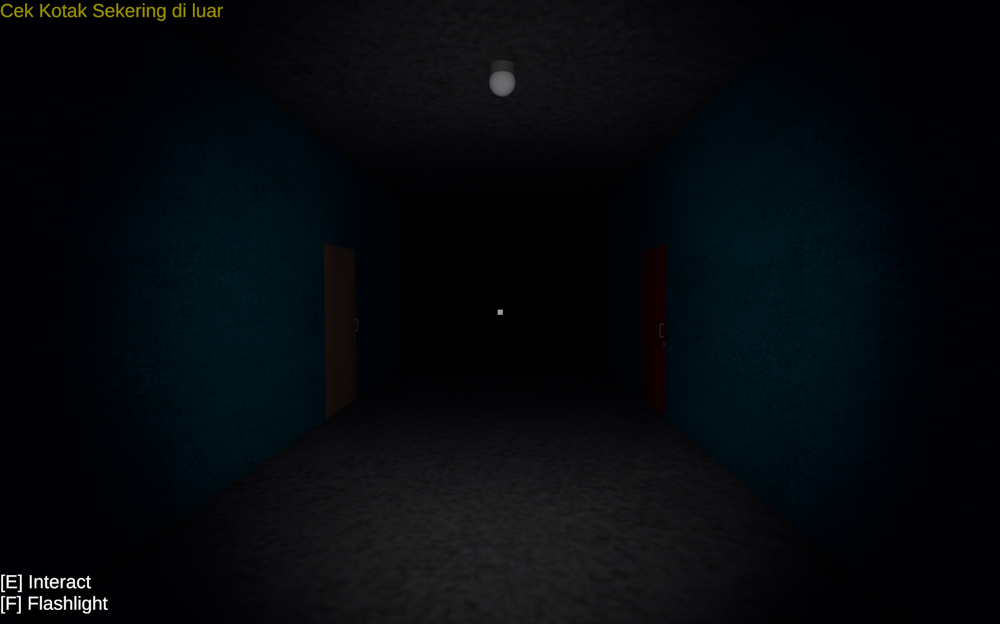
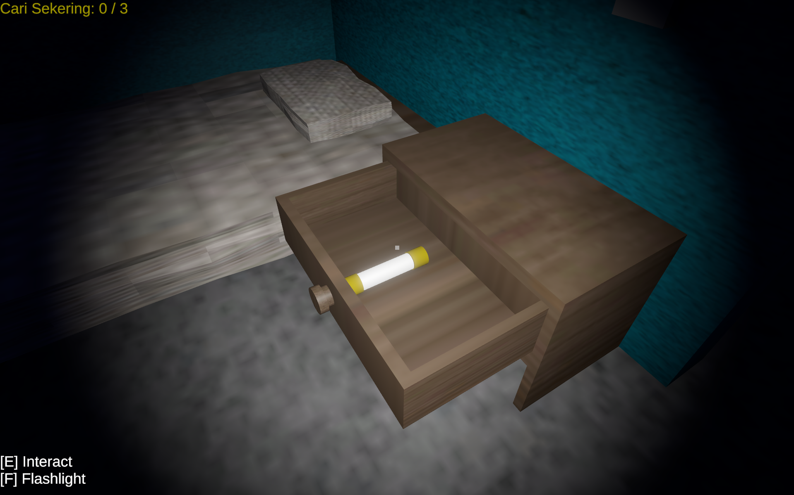
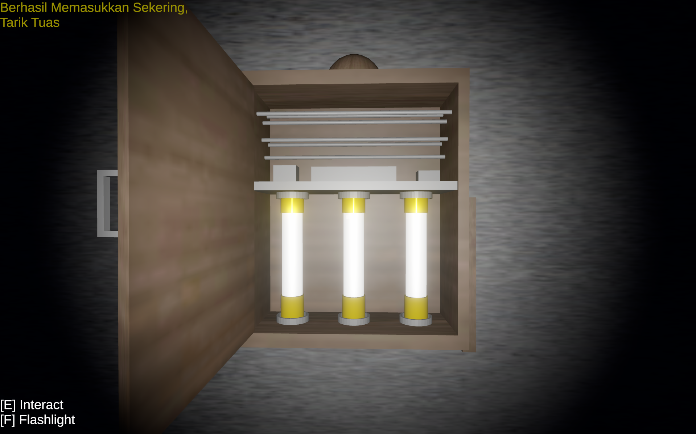

# Sekering (The Fuse) 🔦

**Sekering** adalah sebuah proyek game horror 3D *First-Person* bergaya *story-driven* yang berfokus pada atmosfer dan ketegangan psikologis. Dikembangkan menggunakan Unity 3D.

## 🎮 Alur Permainan (Gameplay)
* **Awal Mula:** Pemain berada di dalam sebuah bangunan kecil. Tiba-tiba terdengar suara pemutus arus (jeglek), dan seluruh lampu mati total. Suasana berubah menjadi gelap gulita.
* **Tujuan Utama:** Pemain harus mencari jalan keluar melalui pintu utama. Namun, pintu tersebut terkunci oleh sistem elektronik yang tidak berfungsi akibat pemadaman listrik.
* **Mekanik Pencarian:** Dengan hanya berbekal sebuah senter, pemain harus mengeksplorasi ruangan-ruangan gelap untuk mencari 3 buah sekering (*fuse*) yang tersembunyi secara acak.
* **Tantangan Horror:** Game ini mungkin tidak mengandalkan "*jump  scare*" dari entitas musuh. Rasa takut dibangun murni melalui atmosfer: suara langkah kaki yang menggema, hembusan angin, pintu yang tiba-tiba berderit, dan jarak pandang senter yang sangat terbatas.
* **Penyelesaian:** Setelah ketiga sekering ditemukan, pemain dapat berinteraksi dengan kotak panel listrik. Cahaya akan menyala kembali, suasana mencekam menghilang, dan pintu utama dapat dibuka untuk memenangkan permainan.

## 📷 Cuplikan Permainan

## 💡 Sorotan Proyek & Mekanik
Proyek ini didesain dengan ruang lingkup yang padat dan terarah untuk memaksimalkan implementasi fitur inti:
* **Mekanik Terfokus:** Mengutamakan sistem pergerakan dasar (berjalan dan berlari), kontrol senter, dan interaksi objek. Fitur pergerakan kompleks seperti *crouch* (jongkok) atau melompat sengaja ditiadakan untuk menjaga stabilitas level dan mencegah *bug*.
* **Fokus pada Atmosfer:** Mengandalkan sistem *Lighting* dan *Audio* spasial di Unity sebagai instrumen utama pembuat ketegangan.
* **Desain Level Efisien:** Menggunakan peta berskala kecil yang tertutup (terdiri dari 3-4 ruangan esensial) agar alur permainan tetap intens dari awal hingga akhir.

## 🗺️ Roadmap Pengembangan
Berikut adalah tahapan pengembangan proyek game ini:
- [x] **Setup & Pergerakan:** Inisialisasi proyek Unity dan pembuatan *First Person Controller*.
- [x] **Desain Level Dasar:** *Prototyping* lantai, dinding, dan pintu.
- [x] **Mekanik Senter:** Implementasi sistem lampu sorot (*toggle on/off*).
- [x] **Sistem Interaksi (Raycast):** Deteksi objek saat pemain menatap sekering dan input interaksi untuk mengambil barang.
- [x] **Kondisi Menang & UI:** Penambahan antarmuka pengguna dan logika penyelesaian (3 sekering terkumpul = listrik menyala).
- [x] **Main Menu:** Pembuatan layar awal dengan tombol *Play* dan *Quit*.
- [x] **Polesan Akhir (Audio & Lighting):** Integrasi efek suara horor dan penyesuaian gelap-terangnya ruangan.

## Rilis
* **v1.0:** Kamis, 19 Februari 2026

---
*Developed by Sandzzz Dev | Sambas, Indonesia | Sabtu, 14 Februari 2026*

